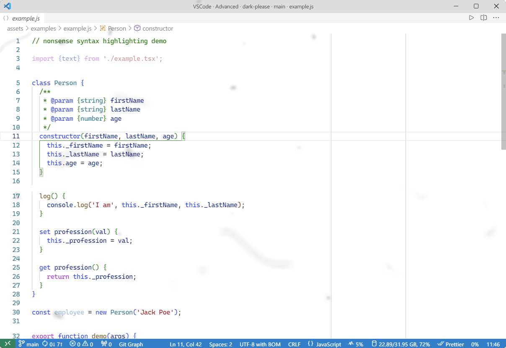
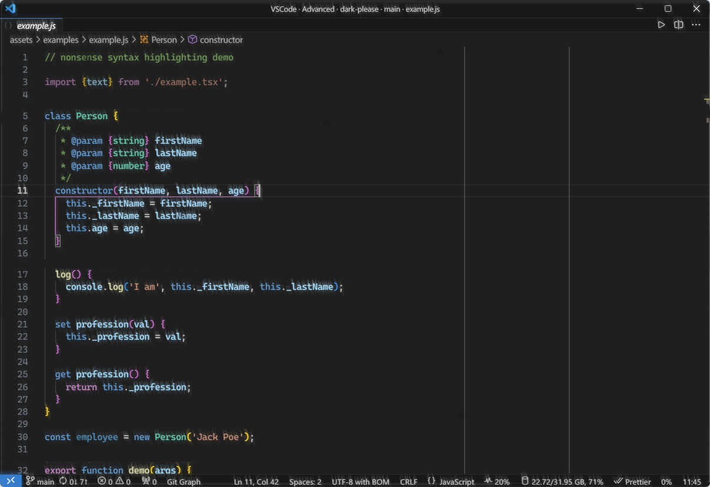
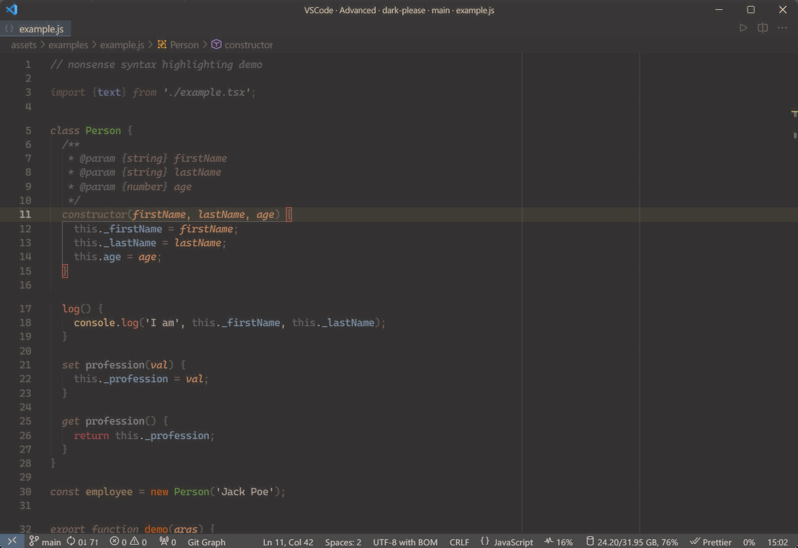
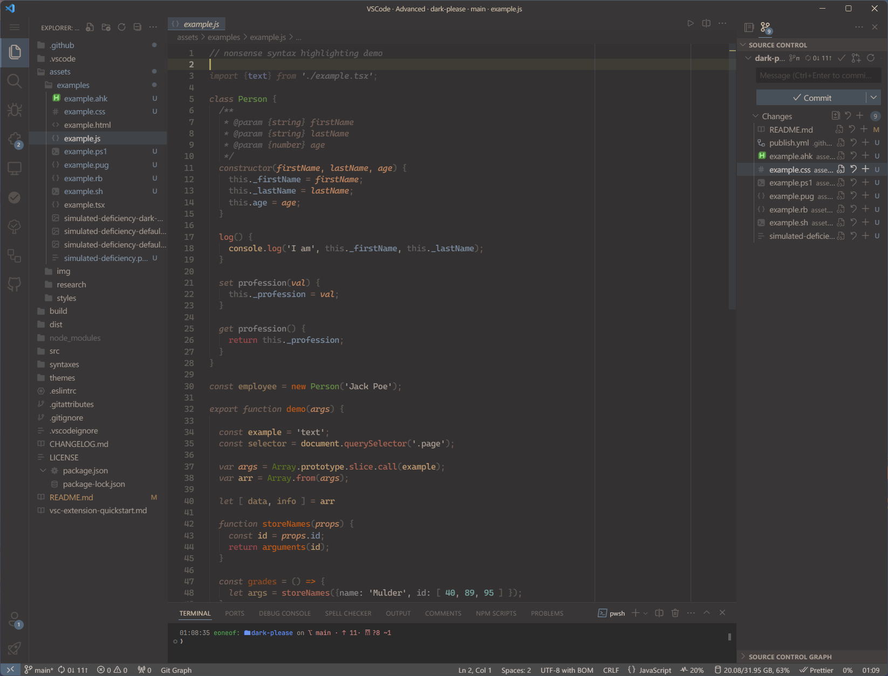
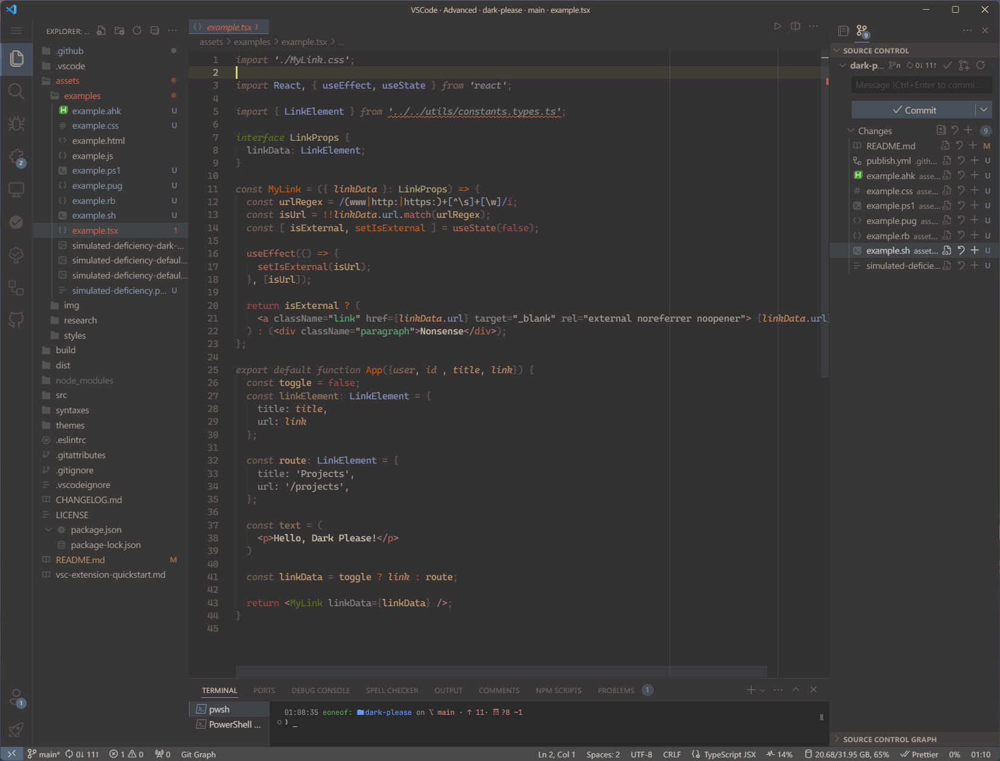
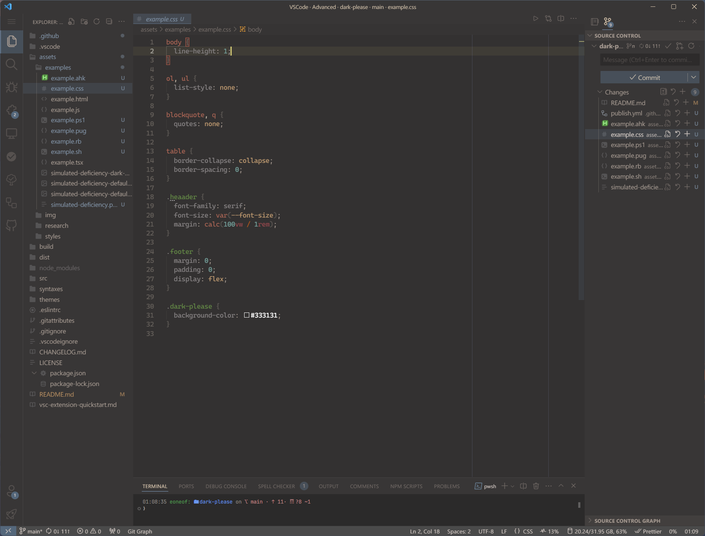
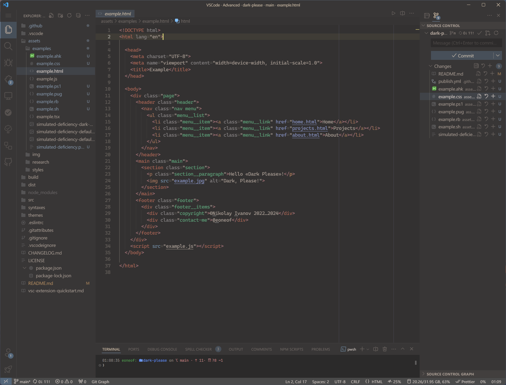
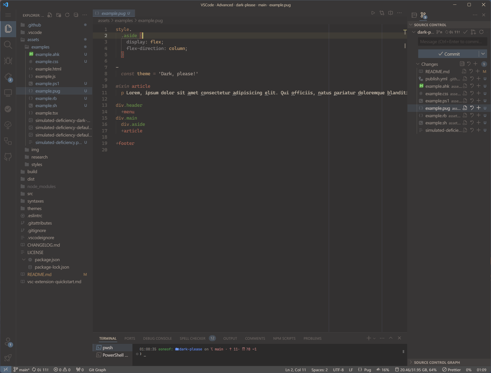
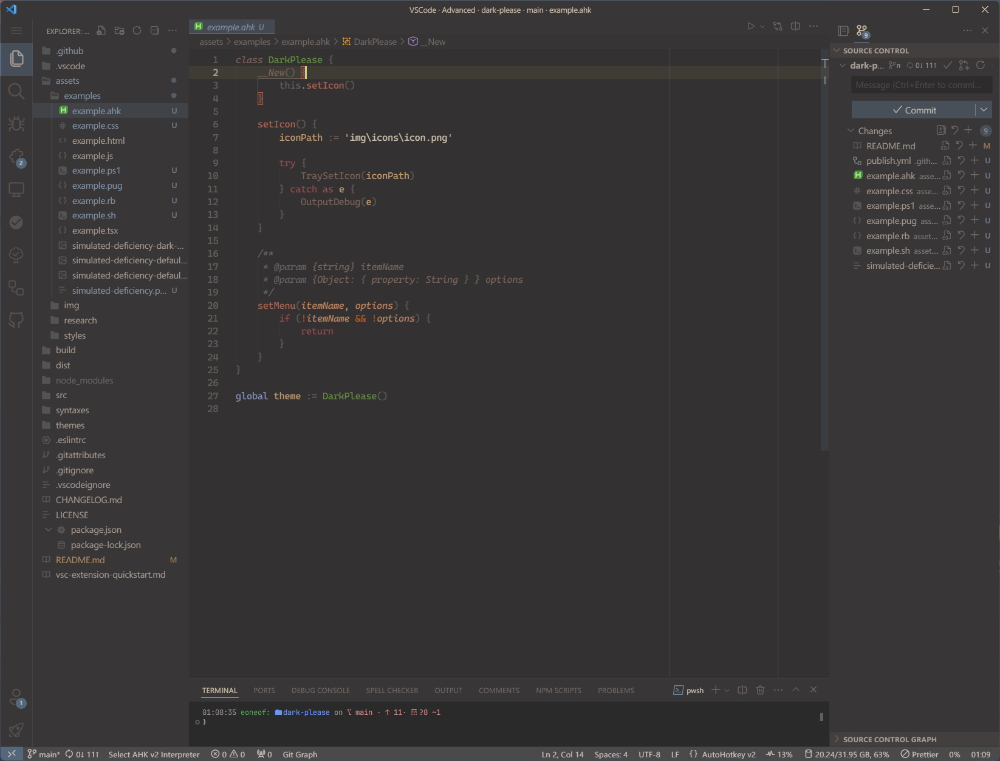
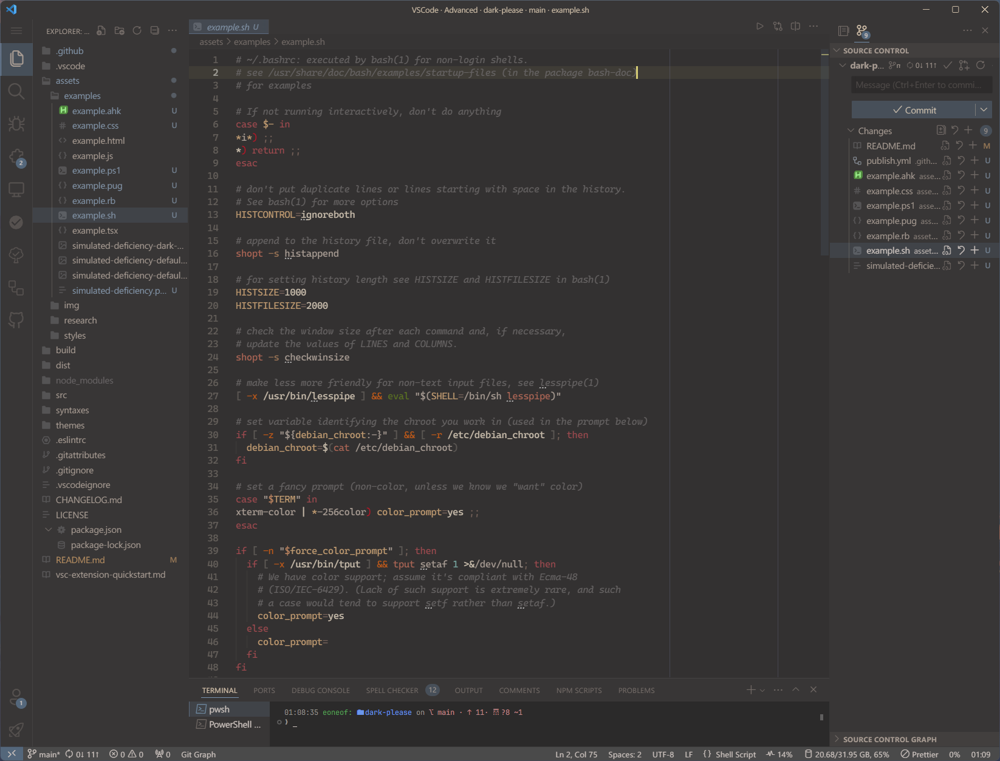

# 

> A pleasant-looking low contrast dark theme for VSCode with handpicked semantic highlighting colors. No fancy color theories behind, but personal perception.

## Why another one theme?

Due to my visual peculiarities, I couldn't find a suitable theme for me. 

On light colored themes, all the floaters in my eyes become really annoying:

Dark ones are too contrasty and give a ghosting and a halo effects:

And also all the themes I tried were not informative enough and mottled with borders, hovers and unnecessary highlighting. So I decided to make a customized theme for myself

## Supported languages

### Markdown

### JavaScript/TypeScript

### CSS/SCSS

### HTML

### Pug/Jade

### Ruby (partial)

### Autohotkey

### Powershell

### Bash

### Resources on the screenshots

**Fonts**

- Editor — `Cascadia Code`
- Terminal, ErrorLens — `Jetbrains Mono`

**Icons**

- File icons — [*Quill*](https://marketplace.visualstudio.com/items?itemName=cdonohue.quill)
- Product icons — [*Fluent*](https://marketplace.visualstudio.com/items?itemName=miguelsolorio.fluent-icons)

## Credits

- [**ACE Util**](https://github.com/dfernandez79/ase-util) — Utility library to handle Adobe Swatch Exchange (ASE) files.
- [**Eppz! Theme**](https://github.com/Geri-Borbas/VSCode.Extension.eppz_Code) — Styling ideas and color palette reference.
- [**Semantic Rainbow Theme**](https://github.com/Thertzlor/semantic-rainbow/) — Used as a starting point.
- [**Horizon Dark Theme**](https://horizontheme.netlify.app/) — Semantic Rainbow started as an extension of this theme and it remains an influence especially in the non-syntax parts.
- [**TinyColor**](https://github.com/bgrins/TinyColor) — Used for color transformations.
